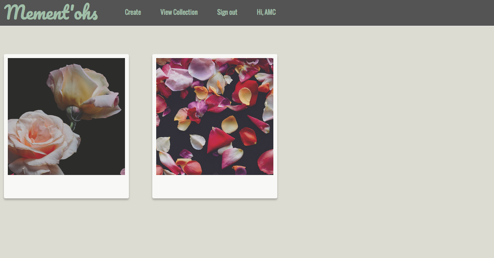
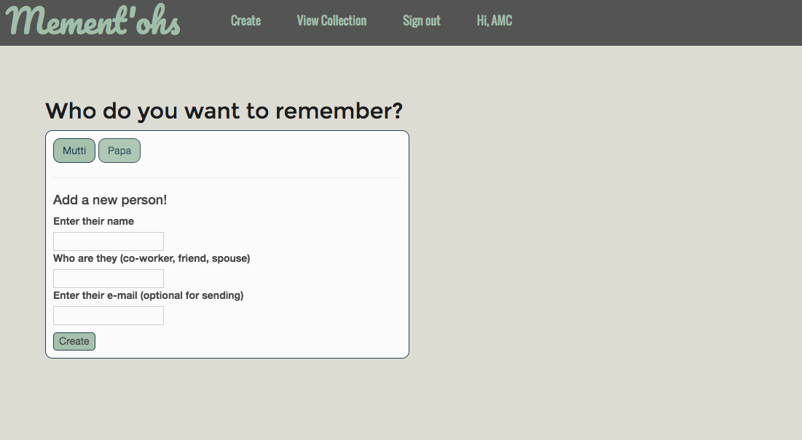

# Mememt-ohs

#### Friday independent project that creates a simple website to store user mementos. 04/27/2018

#### By **Anna Marie Cooper**

## Description

This web application will allow a user to store mementos associated with important people in their lives.

<kbd></kbd>

#### Learning Objectives
1. Learn more about routing and custom routing
2. Practice paperclip and devise in another situation

#### Behavior
1. Allows user to log in or create account.
2. Allows allows user to add a new recipient.
3. Allows user to add a new memento associated with that person.
4. Allows user to view all mementos.

#### Future Behavior
1. Allow user to select a previous recipient to add a memento to with a drop down or links, so no redundancies are created.

<kbd></kbd>

## Setup/Installation Requirements
* Open terminal
* Move to desired folder
* Type  _`$ git clone https://github.com/rogueminx/mement-ohs.git`_
* Type _`$ cd mement-ohs`_ to move to directory.
* Type _`bundle exec`_ to install all necessary gems
* Type _`rails db:create`_ to create the database.
* Type _`rails db:migrate`_ to run migrations for database
* To view the website, type : _`$ rails server `_ and navigate to `http://localhost:3000/`

## Known Bugs

None

## Support and contact details

Please contact me through Github with questions.

## Technologies Used

* HTML
* CSS
* Bootstrap
* Ruby
* Rails

### License

Copyright (c) 2018  **Anna Marie Cooper**
